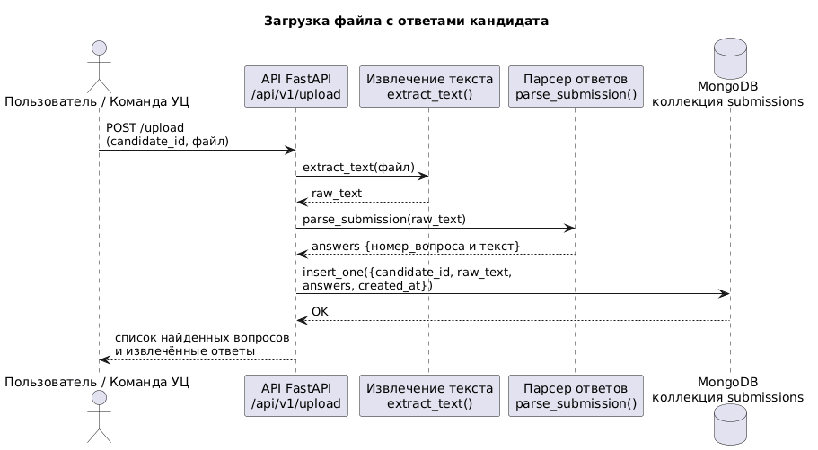
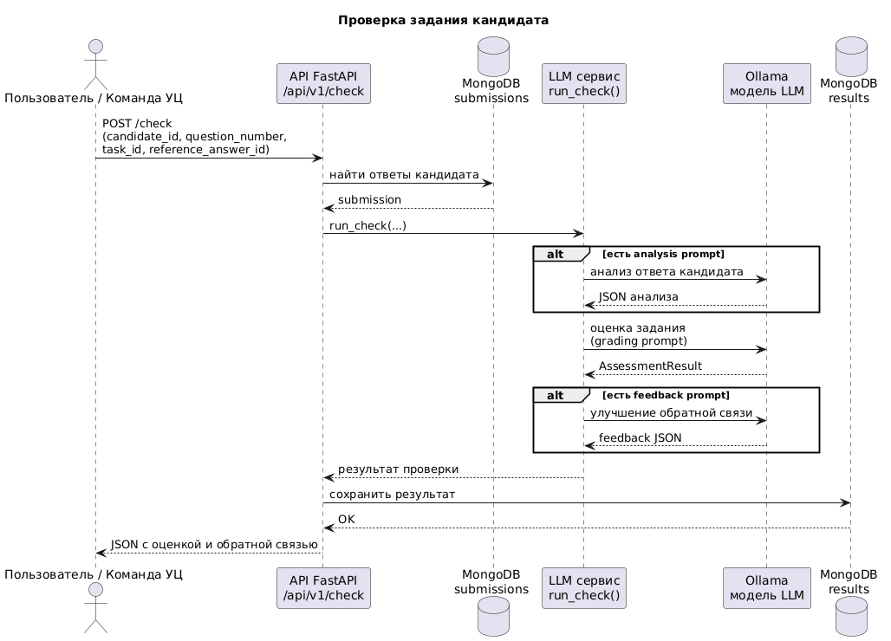
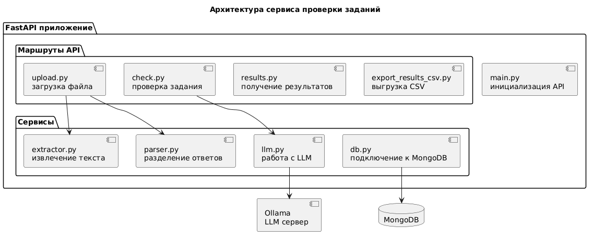

1. Запускаем локально Ollama с предзагруженной моделью gpt-oss:20b (модель задается переменной model
   в [llm.py](app/services/llm.py)).
2. Запускаем MongoDb в контейнере при помощи прилагаемого [docker-compose.yml](docker-compose.yml)
3. Запускаем само приложение, используя [main.py](app/main.py) (например через uvicorn app.main:app --reload)
4. Примеры запросов приложены в виде коллекции для Postman в
   файле [hackathon.postman_collection.json](hackathon.postman_collection.json)

## Архитектура системы

Диаграммы архитектуры находятся в `docs/diagrams`.

### Поток загрузки ответа

### Поток проверки задания

### Архитектура компонентов
